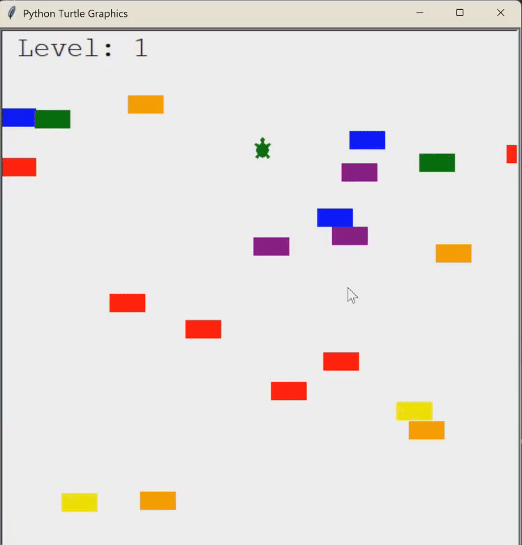

# 🐢 Turtle Crossing Game

A simple arcade-style game built using Python's `turtle` module. 
Inspired by the classic Frogger game, the goal is to help the turtle cross the road while dodging randomly moving cars.

---

## 🎮 How to Play

- Use the **Up Arrow** key to move the turtle forward.
- Hold to continuously move up.
- Avoid the oncoming traffic!
- Each time the turtle reaches the top safely, the level increases, and cars move faster.
- The game ends when the turtle collides with a car.

---

## 📸 Demo


---

## 🧠 Features

- Dynamic car generation with randomized speed and color.
- Increasing difficulty with each level.
- Collision detection and game-over message.
- Object-oriented structure with custom classes.

---

## 📁 Project Structure
```
turtle_crossing_game/
│
├── turtle_crossing_main.py # Main game loop
├── player.py # Player's turtle logic
├── READme.md # This file
├── scoreboard.py # Level tracking and game over screen
└── car_manager.py # Car spawning and movement
```

---

## 🛠️ Tech Stack

- Python 3.x
- `turtle` module (standard library)

---

## ▶️ Getting Started

1. Clone the repository:
   ```bash
   git clone https://github.com/JustinWoo20/turtle-crossing-game.git```

2. Navigate into the project:
    cd turtle-crossing-game

3. Run the game:
    python turtle_crossing_main.py

---

## 📌 Future Improvements

Add sounds for collisions and level-ups.

Add lives or health system.

Allow left and right movement.

Add a main menu and restart functionality.

---

### © License
MIT License. Free to use and modify.